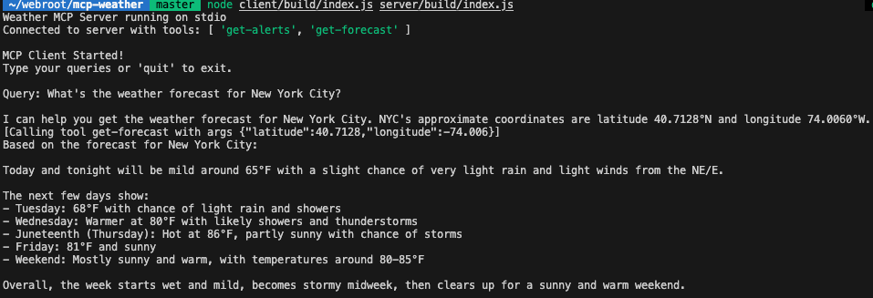

# MCP Weather

A weather information application that uses Anthropic Claude's LLM to query US weather data through the National Weather Service (NWS) API. This project is based on Anthropic's official MCP (Model Context Protocol) examples.

## Overview

This project consists of two main components:

- A server that provides weather tools via the Model Context Protocol (MCP)
- A client that connects to the server and uses Anthropic Claude to process user queries

## Demo


_Screenshot of the MCP Weather application in action_

## Features

- Get weather alerts for any US state
- Get weather forecasts for any US location by coordinates
- Natural language interface powered by Anthropic Claude 3.5 Sonnet

## Prerequisites

- Node.js (v16 or higher)
- An Anthropic API key

## Setup

1. Clone this repository

   ```
   git clone https://github.com/your-username/mcp-weather.git
   cd mcp-weather
   ```

2. Add your Anthropic API key to the environment

   ```
   # Create a .env file in the project root
   echo "ANTHROPIC_API_KEY=your_anthropic_api_key_here" > .env
   ```

3. Build the client

   ```
   cd client
   npm install
   npm run build
   ```

4. Build the server
   ```
   cd ../server
   npm install
   npm run build
   ```

## Usage

Run the application using the built files:

```
node client/build/index.js server/build/index.js
```

Enter your weather queries in natural language, for example:

- "What's the weather forecast for New York City?"
- "Are there any weather alerts in California?"
- "What will the temperature be in Chicago tomorrow?"

## Available Weather Tools

- `get-alerts`: Get weather alerts for a US state (requires two-letter state code)
- `get-forecast`: Get weather forecast for a location (requires latitude and longitude)

## Security Note

This application requires an Anthropic API key to function. Never commit your `.env` file or expose your API key in public repositories.

## License

[MIT License](LICENSE)
